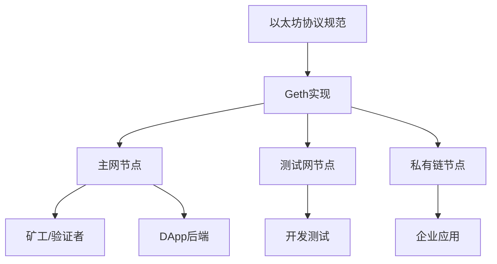

# Go-Ethereum 理论分析报告

## 1. Geth在以太坊生态中的定位

### 1.1 核心地位
Go-Ethereum（Geth）是以太坊的官方参考实现，在以太坊生态系统中占据核心地位：

- **参考标准**：作为以太坊协议的权威实现，为其他客户端提供标准参考
- **网络支柱**：运行着以太坊主网上大部分的全节点
- **开发基础**：为DApp开发者提供完整的区块链交互接口
- **协议演进**：承载着以太坊协议升级和新特性的首发实现

### 1.2 生态系统角色


## 2. 核心模块交互关系解析

### 2.1 区块链同步协议

#### eth/62 协议特性
- **基础同步**：支持区块头、区块体、交易数据同步
- **状态同步**：提供账户状态和存储状态的快速同步
- **节点发现**：基于Kademlia DHT的节点发现机制

#### eth/63 协议改进
- **快照同步**：引入状态快照，大幅提升同步速度
- **轻节点支持**：优化轻节点协议，减少带宽需求
- **并行处理**：支持并行下载和验证，提高效率

```go
// 同步协议核心接口
type ProtocolManager struct {
    networkID     uint64
    fastSync      uint32
    acceptTxs     uint32
    checkpointNumber uint64
    checkpointHash   common.Hash
    
    txpool      txPool
    blockchain  *core.BlockChain
    chaindb     ethdb.Database
    maxPeers    int
    
    downloader *downloader.Downloader
    fetcher    *fetcher.Fetcher
    peers      *peerSet
}
```

### 2.2 交易池管理与Gas机制

#### 交易池架构
```go
type TxPool struct {
    config      TxPoolConfig
    chainconfig *params.ChainConfig
    chain       blockChain
    gasPrice    *big.Int
    txFeed      event.Feed
    scope       event.SubscriptionScope
    signer      types.Signer
    mu          sync.RWMutex
    
    currentState  *state.StateDB
    pendingNonces *txNoncer
    currentMaxGas uint64
    
    locals  *accountSet
    journal *txJournal
    
    pending map[common.Address]*txList
    queue   map[common.Address]*txList
    beats   map[common.Address]time.Time
    all     *txLookup
    priced  *txPricedList
}
```

#### Gas机制实现
- **Gas估算**：基于历史数据和网络状况动态估算
- **Gas价格**：支持EIP-1559的基础费用+小费机制
- **Gas限制**：区块级别和交易级别的双重限制

### 2.3 EVM执行环境构建

#### EVM核心组件
```go
type EVM struct {
    Context BlockContext
    TxContext
    StateDB StateDB
    depth   int
    
    chainConfig *params.ChainConfig
    chainRules  params.Rules
    vmConfig    Config
    
    interpreters []Interpreter
    interpreter  Interpreter
    abort        int32
    callGasTemp  uint64
}
```

#### 执行流程
1. **环境初始化**：设置区块上下文、交易上下文
2. **状态准备**：加载账户状态、合约代码
3. **指令执行**：逐条执行字节码指令
4. **状态更新**：提交状态变更、计算Gas消耗
5. **结果返回**：返回执行结果、事件日志

### 2.4 共识算法实现

#### Ethash（工作量证明）
```go
type Ethash struct {
    config Config
    caches   *lru // In memory caches to avoid regenerating too often
    datasets *lru // In memory datasets to avoid regenerating too often
    
    mining    int32
    rand      *rand.Rand
    threads   int
    update    chan struct{}
    hashrate  metrics.Meter
    
    shared    *Ethash
    fakeFail  uint64
    fakeDelay time.Duration
}
```

#### POS（权益证明）过渡
- **信标链集成**：与Eth2.0信标链的交互机制
- **验证者管理**：质押、惩罚、奖励机制
- **最终性保证**：基于CASPER FFG的最终性算法

## 3. 关键技术特性

### 3.1 P2P网络层
- **Kademlia DHT**：分布式哈希表实现节点发现
- **RLPx协议**：加密的点对点通信协议
- **节点类型**：全节点、轻节点、归档节点的差异化实现

### 3.2 存储层设计
- **LevelDB**：高性能键值存储引擎
- **MPT树**：默克尔帕特里夏树实现状态存储
- **快照机制**：状态快照加速同步和查询

### 3.3 API接口层
- **JSON-RPC**：标准的区块链交互接口
- **GraphQL**：灵活的查询接口
- **WebSocket**：实时事件订阅机制

## 4. 性能优化策略

### 4.1 同步优化
- **快速同步**：跳过历史状态验证
- **快照同步**：基于状态快照的快速启动
- **并行处理**：多线程并行下载和验证

### 4.2 存储优化
- **状态修剪**：删除过期的历史状态
- **数据压缩**：RLP编码和数据压缩
- **缓存策略**：多级缓存提升访问性能

### 4.3 网络优化
- **连接管理**：智能的节点连接策略
- **带宽控制**：动态调整网络带宽使用
- **协议升级**：向后兼容的协议演进机制

## 总结

Geth作为以太坊的参考实现，通过精心设计的模块化架构，实现了高性能、高可靠性的区块链节点。其核心模块之间的协调配合，为以太坊网络的稳定运行提供了坚实基础。随着以太坊2.0的推进，Geth也在不断演进，适应新的共识机制和性能要求。