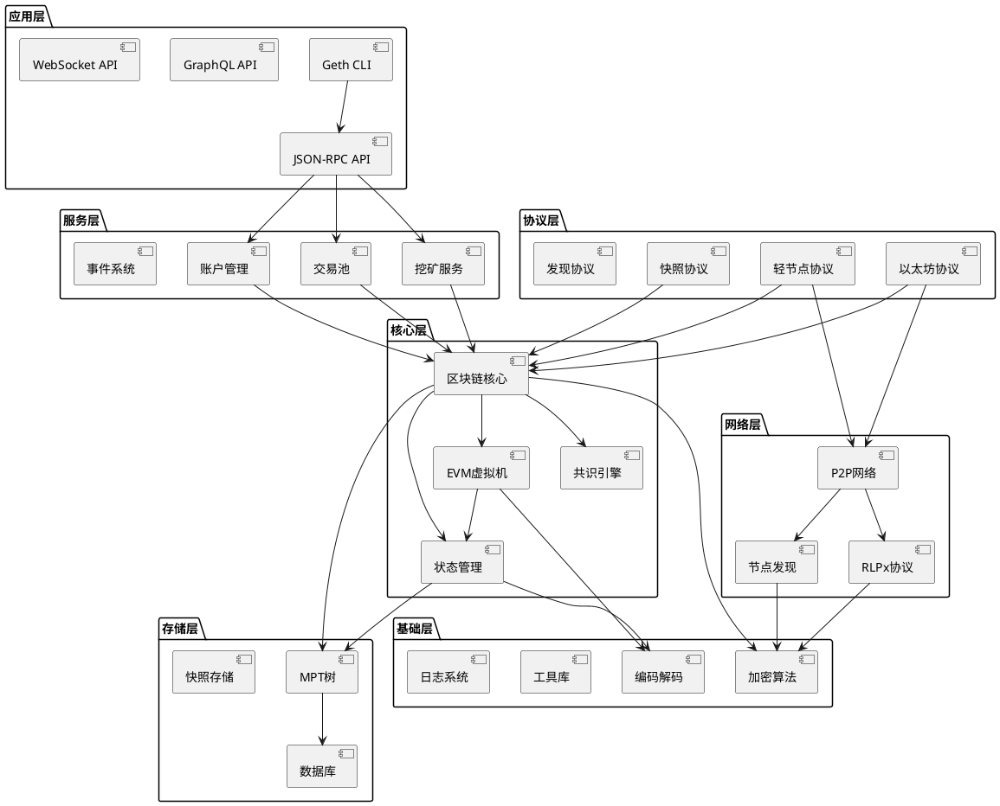
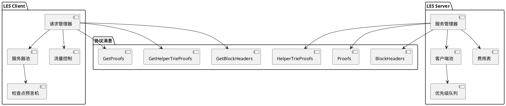
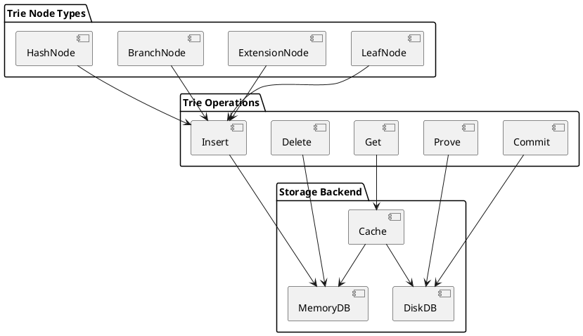
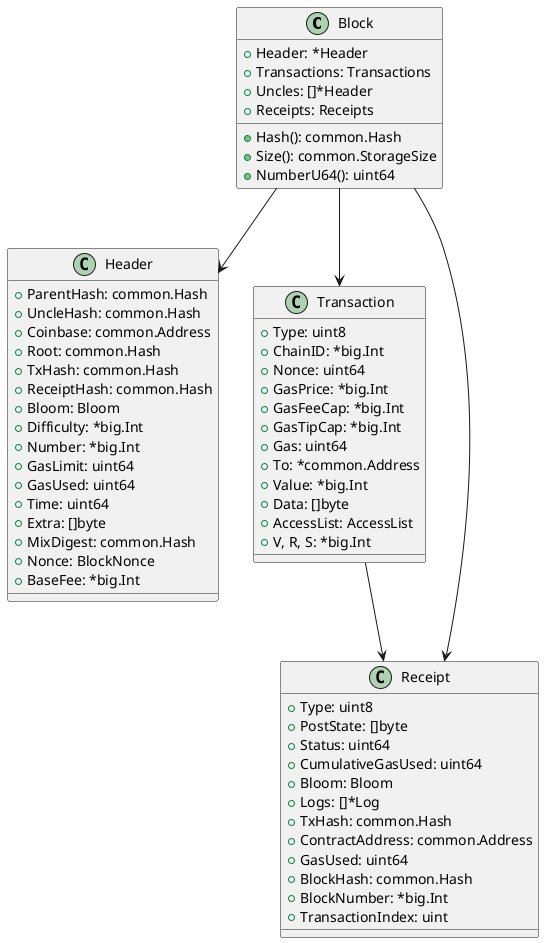
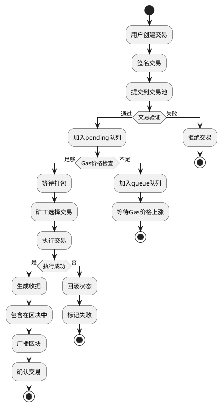
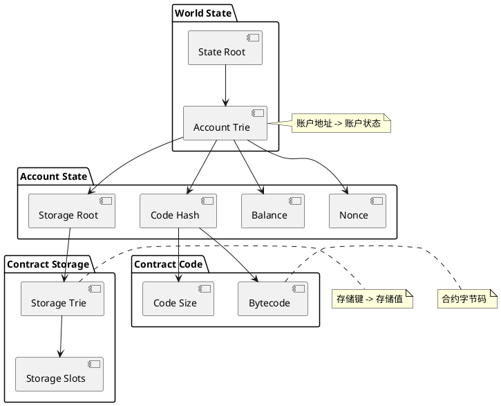

# Go-Ethereum 架构设计文档

## 1. 分层架构总览

### 1.1 整体架构图



### 1.2 架构层级说明

#### 应用层（Application Layer）
- **功能**：提供用户交互接口和外部API
- **组件**：CLI命令行、JSON-RPC、GraphQL、WebSocket
- **职责**：请求路由、参数验证、响应格式化

#### 服务层（Service Layer）
- **功能**：核心业务逻辑封装
- **组件**：账户管理、挖矿服务、交易池、事件系统
- **职责**：业务流程控制、状态管理、事件分发

#### 协议层（Protocol Layer）
- **功能**：区块链网络协议实现
- **组件**：以太坊协议、轻节点协议、快照协议
- **职责**：网络通信、数据同步、协议升级

#### 核心层（Core Layer）
- **功能**：区块链核心逻辑
- **组件**：区块链核心、EVM、状态管理、共识引擎
- **职责**：区块验证、交易执行、状态转换

#### 存储层（Storage Layer）
- **功能**：数据持久化存储
- **组件**：MPT树、数据库接口、快照存储
- **职责**：数据存储、状态查询、历史追溯

#### 网络层（Network Layer）
- **功能**：点对点网络通信
- **组件**：P2P网络、节点发现、RLPx协议
- **职责**：节点连接、消息传输、网络维护

#### 基础层（Foundation Layer）
- **功能**：基础工具和算法
- **组件**：加密算法、编码解码、工具库
- **职责**：基础功能、工具支持、系统服务

## 2. 关键模块详细设计

### 2.1 LES（轻节点协议）



#### LES核心特性
- **按需同步**：只下载需要的区块头和状态证明
- **服务器发现**：动态发现和连接LES服务器
- **流量控制**：基于令牌桶的请求限流机制
- **费用机制**：为轻节点服务提供经济激励

### 2.2 Trie（默克尔树实现）



#### MPT树特性
- **路径压缩**：通过扩展节点减少树的深度
- **十六进制编码**：使用Hex编码优化存储效率
- **惰性加载**：按需从数据库加载节点数据
- **状态证明**：生成默克尔证明验证状态

### 2.3 Core/Types（区块数据结构）



## 3. 交易生命周期流程图



## 4. 账户状态存储模型



### 状态存储特性

#### 账户状态组成
- **Nonce**：账户交易计数器，防止重放攻击
- **Balance**：账户以太币余额
- **StorageRoot**：合约存储状态树根哈希
- **CodeHash**：合约代码哈希值

#### 存储优化策略
- **状态修剪**：定期清理过期的历史状态
- **快照机制**：创建状态快照加速访问
- **缓存分层**：内存缓存 + 磁盘缓存 + 数据库

#### 状态同步机制
- **快速同步**：下载最新状态而非重放历史
- **快照同步**：基于状态快照的增量同步
- **状态修复**：检测和修复损坏的状态数据

## 5. 性能优化设计

### 5.1 并发处理架构

```plantuml
@startuml 并发处理架构
package "交易处理" {
    [交易验证] as txvalid
    [交易执行] as txexec
    [状态更新] as stateupdate
}

package "区块处理" {
    [区块验证] as blockvalid
    [区块导入] as blockimport
    [链重组] as reorg
}

package "网络处理" {
    [消息接收] as msgreceive
    [消息处理] as msgprocess
    [消息发送] as msgsend
}

txvalid ||--|| txexec
txexec ||--|| stateupdate

blockvalid ||--|| blockimport
blockimport ||--|| reorg

msgreceive ||--|| msgprocess
msgprocess ||--|| msgsend

note right of txvalid : 并行验证交易签名
note right of blockvalid : 并行验证区块头
note right of msgreceive : 异步处理网络消息

@enduml
```

### 5.2 缓存策略设计

- **多级缓存**：L1内存缓存 + L2磁盘缓存
- **LRU淘汰**：最近最少使用算法管理缓存
- **预取机制**：预测性加载热点数据
- **写入合并**：批量写入减少磁盘IO

## 总结

Geth的架构设计体现了现代区块链系统的设计精髓：
1. **分层解耦**：清晰的层次结构便于维护和扩展
2. **模块化设计**：独立的功能模块支持灵活组合
3. **性能优化**：多维度的性能优化策略
4. **可扩展性**：支持协议升级和功能扩展

这种架构设计为以太坊网络的稳定运行和持续演进提供了坚实的技术基础。